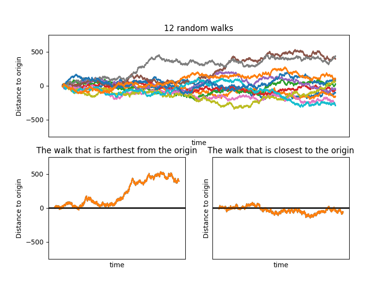
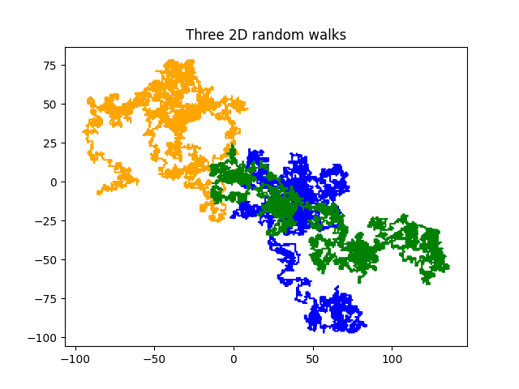
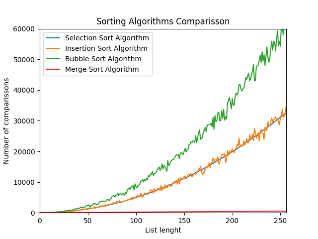
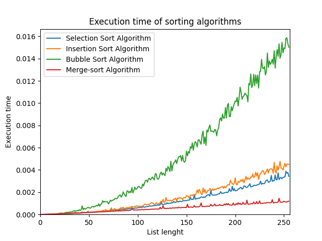

# Python Coding

* Python programs for practicing.
* Python fundamentals.

## Code and Resources Used 
**Python Version:** 3.7  
**Packages:** random, numpy, math, pandas, datetime, matplotlib

# Content
* Variables
* Functions
* Lambda
* OOP
* Objects and classes
* Recursion
* Iteration

### [Random Walks](random_walk.py)

### [2D Random Walks](random_walk_2D.py)

### [Seconds Lived](seconds_lived.py)

Made a program that calculates the seconds you have already lived.
Today: November 26, 2021
I've already lived 957.80M seconds. Could you guess my date of birth?

### [Fibonacci sequence](fibonacci_sequence.py)

Recursion is never the best answer: example of low efficency recursion. A program comparing recursion vs iteration with Fibonacci sequence. 

### [Pascal triangle](pascal_triangle.py)

Pascal's triangle is a triangular array of the binomial coefficients that arises in probability theory, combinatorics and algebra. I made a program that returns the value found in the chosen row and column of a Pascal triangle.
### [Paper sizes ISO216](papersize_ISO216.py) 

I created a recursive function that returns the width and length of sheet A(N) based on the ISO216.

### [Control tower simulation](control_tower_simulation.py) 

I developed a simulation that models the work of an airport control tower.

### Sorting algorithms
* [Bubble sort](bubblesort_algorithm.py)
* [Selection sort](selectionsort_algorithm.py)
* [Insertion sort](insertionsort_algorithm.py)
* [Merge sort](mergesort_algorithm.py)

Compared different sorting algorithms:

[Based on number of comparissons made](comparing_sorting_algorithms.py)

[Based on execution time](time_sorting_algorithms.py)

